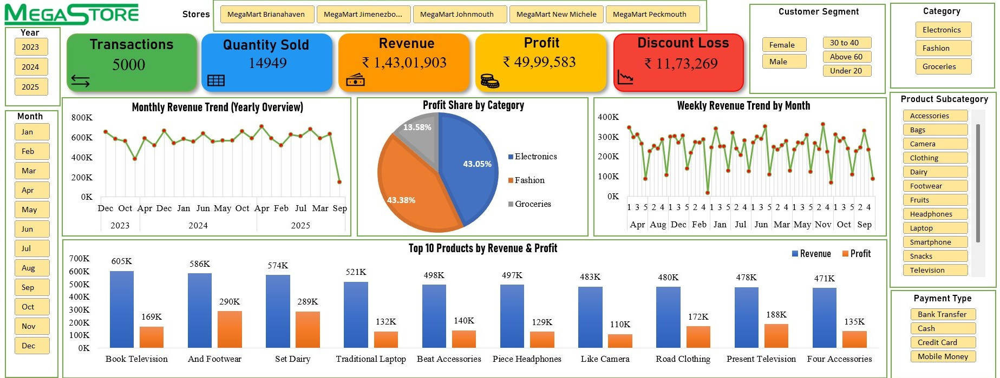

# Retail Sales Dashboard Project

_A dynamic MS Excel-based Retail Sales Dashboard, built using Pivot Tables, DAX, and visualizations, that highlights KPIs, trends, and insights to support data-driven business decisions._

---
## Table of Contents  

1. <u>[Overview](#overview)</u>  
2. <u>[Screenshot](#screenshot)</u>  
3. <u>[Project Description](#project-description)</u>  
4. <u>[Project Objective](#project-objective)</u>  
5. <u>[Dataset Description](#dataset-description)</u>  
6. <u>[Dashboard Highlights](#dashboard-highlights)</u>  
7. <u>[Key Insights](#key-insights)</u>  
8. <u>[Tools & Skills Used](#tools--skills-used)</u>  
9. <u>[How to Use This Project](#how-to-use-this-project)</u>  
10. <u>[Conclusion](#conclusion)</u>  
11. <u>[Author](#author)</u>  
12. <u>[Contact](#contact)</u>  

## Overview
A dynamic sales dashboard designed to provide actionable insights into sales performance, helping businesses track trends and make informed decisions.  

Highlights

- **Data Cleaning & Preparation**: Processed raw sales data for accurate analysis.

- **Pivot Tables & Power Pivot**: Aggregated sales, revenue, quantity, and profit efficiently.

- **DAX Calculations**: Computed KPIs like profit margin, discount leakage, and sales growth.

- **Interactive Visualizations**: Dynamic charts to track sales trends, top products, and category performance.

- **Insights Delivered**: Enables businesses to monitor KPIs and make data-driven decisions.

---
## Screenshot

---
## Project Description

Sales analysis is essential for understanding business performance, identifying trends, and making strategic decisions. This project leverages MS Excel to clean and pre-process sales data, analyze multiple metrics, and create a dynamic dashboard that visualizes key performance indicators (KPIs) such as sales trends, category performance, regional sales, top products, and profit margins.

---
## Project Objective

The goal of this project is to create a dynamic and interactive sales dashboard. It tracks key metrics such as transactions, revenue, quantity sold, profit, and discount leakage. The dashboard helps businesses identify trends and patterns across products, categories, and time periods. It enables performance comparisons to uncover growth opportunities. Provides clear visualizations to support data-driven decision making. Helps businesses optimize operations, improve profitability, and make informed strategic decisions.

---
## Dataset Description

The dataset is an Excel workbook containing four worksheets that capture the complete retail business data. (Time frame: 2023–2025)

1. **Customers**: Customer details including CustomerID, FirstName, LastName, Gender, BirthDate, City, and JoinDate.  

2. **Products**: Product information with ProductID, ProductName, Category, SubCategory, UnitPrice, and CostPrice.

3. **Stores**: Store details such as StoreID, StoreName, City, and Region.

4. **Transactions**: Transaction-level data including TransactionID, Date, CustomerID, ProductID, StoreID, Quantity, Discount, and PaymentMethod.

This dataset enables the creation of KPIs, pivot tables, Power Pivot models, DAX calculations, and interactive dashboards to provide actionable insights into sales performance, customer trends, and product performance.

---
## Dashboard Highlights

The Retail Sales Dashboard provides interactive insights into sales performance using dynamic slicers, KPIs, and visualizations, enabling stakeholders to monitor key metrics, analyze trends, and make data-driven business decisions.

1. **Dynamic Slicers**

    - ***Time: Year, Month*** — for both high-level annual trends and detailed monthly/weekly insights.

    - ***Stores & Customers***: Select specific stores or analyze customer segments by gender and age group.

    - ***Products & Payments***: Drill down by category, sub-category, or payment type to identify patterns and opportunities.
 
2. **Key Performance Indicators (KPIs)**

    - ***Tansactions***: Total number of sales, helping to monitor overall business activity.

    - ***Quantity Sold***: Number of products sold, showing demand trends.

    - ***Revenue***: Total sales value, providing insights into business growth.

    - ***Profit***: Profit generated per transaction or category, highlighting business efficiency.

    - ***Discount Loss***: Revenue lost due to discounts, helping evaluate pricing strategies.
 
3. **Visualizations**

    - ***Monthly Revenue Trend***: Shows yearly revenue patterns, helping to identify seasonal trends and peak sales periods.

    - ***Weekly Revenue Trend by Month***: Provides granular insights into weekly sales performance for better inventory and promotional planning.

    - ***Profit Share by Category***: Visualizes category-wise contribution to profit, assisting businesses in prioritizing high-performing product lines.

    - ***Top 10 Products by Revenue and Profit***: Highlights best-selling and most profitable products, guiding marketing, stocking, and sales strategies.
 
#### Impact & Benefits

- Enables business stakeholders to quickly grasp the overall performance and key trends.

- Supports data-driven decisions for inventory management, pricing strategies, and sales optimization.

- Provides a clear picture of customer behavior, product performance, and store-level sales, helping businesses maximize revenue and profitability.

---
## Key Insights

Over the last three years **(2023–2025)**, our retail business has demonstrated consistent growth and strong customer engagement. With **5,000 transactions**, we sold **14,949 products**, generating **₹14.3M in revenue** and **₹4.99M in profit**, while managing **₹1.17M in discount loss**.

- ***Business Performance Overview***

    - Transactions: 5,000

    - Units Sold: 14,949

    - Total Revenue: ₹14,301,903

    - Total Profit: ₹4,999,589

    - Discount Leakage: ₹1,173,269

    This reflects a healthy **profit margin of ~35%**, despite discount-related losses.
 
- ***Category Insights***

    - Electronics and Fashion dominated, each contributing **~43% of profit**.

    - Groceries followed at **13.5%**, playing a supporting but stable role.

    Within categories:

    - Top Subcategories: Accessories, Smartphones, Televisions, Clothing, Dairy.

    - Highest Profit Products: Smartphones **(₹7.3L)**, Accessories **(₹5.9L)**, Dairy **(₹4.9L)**.    
 
- ***Best-Selling Products***
    Across three years, the Top 10 revenue-generating products were:
    - Book Television

    - And Footwere

    - Set Dairy

    - Traditional Laptop

    - Beat Accessories

    - Piece Headphones

    - Like Camera

    - Road Clothing

    - Present Television

    - Four Accessories

    These products highlight **electronics + fashion dominance** with essential grocery items also ranking well.
 
- ***Customer Demographics***

    - Male Customers: **2,810 transactions** → **₹8.07M revenue** → **₹2.84M profit**

    - Female Customers: **2,190 transactions** → **₹6.23M revenue** → **₹2.15M profit**

    Basket Size Insights:

    - Average Basket Size: **2.99**

    - Males **(under 20)** have the **highest basket size (3.04)**, while older females **(above 60)** show stable purchasing power.
 
- ***Store-Wise Performance***

    Top-performing stores:

    - MegaMart New Michele – ₹2.92M revenue

    - MegaMart Brianahaven – ₹2.90M

    - MegaMart Jimenezborough – ₹2.88M

    - MegaMart Johnmouth – ₹2.84M

    - MegaMart Peckmouth – ₹2.75M

All stores achieved similar **profit margins (~35%)**, showing balanced operational efficiency.
 
- ***Payment Mode Analysis***

    - Cash & Credit Card: **1,280 transactions** each (most used)

    - Mobile Money: **1,276 transactions**

    - Bank Transfer: **1,159 transactions**

    Customers prefer **traditional (cash, card)** and **modern (mobile money)** equally, signaling the need to support digital-first payment options.
 
- ***Top 10 Customers by Revenue***
    Our most valuable customers (2023–2025):

    - Brittany Green – ₹1,43,368

    - Dale Perry – ₹1,17,086

    - Travis Peters – ₹1,12,255

    - Juan Ramirez – ₹1,11,868

    - Matthew Juarez – ₹1,02,379

    - Anna Andrews – ₹1,02,068

    - Richard Jones – ₹1,01,479

    - Vicki Guzman – ₹1,01,239

    - Tyler Levine – ₹1,00,720

    - Carolyn Perez – ₹99,499

    Loyalty programs could be designed for these high-value customers.
 
- ***Revenue Trends (2023–2025)***

    Seasonality detected:

    - Year-end **(Oct–Dec) months** consistently drive **highest revenue (₹6.5–6.6L each)** → festive shopping impact.

    - **Q2 2025 (Apr–Jun)** recorded strong growth, peaking at **₹7.08L in April**.

    This indicates **festival seasons & Q2** surges are revenue drivers.
 
### Key Takeaways

1. Electronics + Fashion = 86% of profits → Continue to expand in these categories.

2. Male customers contribute slightly more revenue & profit → Explore strategies to increase female engagement.

3. Year-end festive months and Q2 each year are growth boosters.

4. Top 5 stores perform consistently → Invest in replicating their success model across locations.

5. Digital payments adoption (esp. mobile money) is strong → Push digital promotions.

6. Customer loyalty programs could enhance retention among top 10 spenders.

---
## Tools & Skills Used

- **Data Analysis & Visualization**: MS Excel, Power Query, Pivot Tables

- **Data Modeling & Calculations**: Power Pivot, DAX

---
## How to Use This Project

1. Download the Excel file (_Sales Dashboard_).
2. Open the Excel file, which contains four worksheets:
    - _Pivot Tables_ – Aggregated sales, revenue, profit, and quantity sold and more.
    - _KPIs_ – Key performance indicators like transactions, revenue, profit, quantity sold, and discount loss.
    - _Dashboard_ – Interactive visualizations with slicers for Year, Month, Store, Customer Segment, Product Category/Sub-Category, and Payment Type.
    - _Insights_ – Analytical findings derived from trends, top-performing products, and category-level performance.
    - Interact with the Dashboard: Use the interactive slicers and charts to filter and drill down into the data for detailed analysis.

---
## Conclusion

This Retail Sales Dashboard project demonstrates my proficiency in data analysis and visualization using MS Excel. It showcases my ability to:

1. Clean and pre-process datasets for accurate analysis

2. Build Pivot Tables and Power Pivot models for efficient data aggregation

3. Use DAX calculations to create meaningful KPIs such as revenue, profit, transactions, quantity sold, and discount loss

4. Design interactive and insightful visualizations to uncover trends, top products, and category-level performance

5. Deliver actionable business insights that support data-driven decisions and optimize sales strategies

This project highlights my capability to transform raw data into meaningful insights that drive business performance and informed decision-making.

---
## Author

***Kartavya Raj*** – Aspiring Data Analyst

Passionate about data analysis, visualization, and business insights. Skilled in Excel, SQL, Power BI, Python (Pandas, NumPy, Matplotlib, Seaborn, Plotly) and data visualization

---
## Contact

For any questions or further information, please contact me.

 

---

[🔼 Back to Top](#retail-sales-dashboard-project)